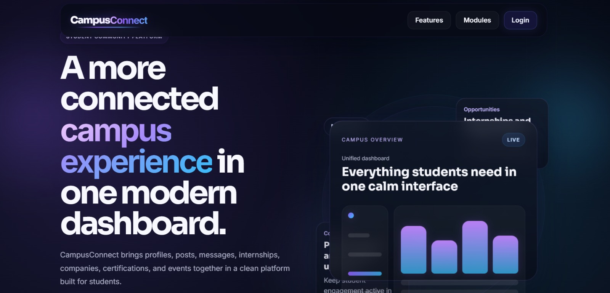
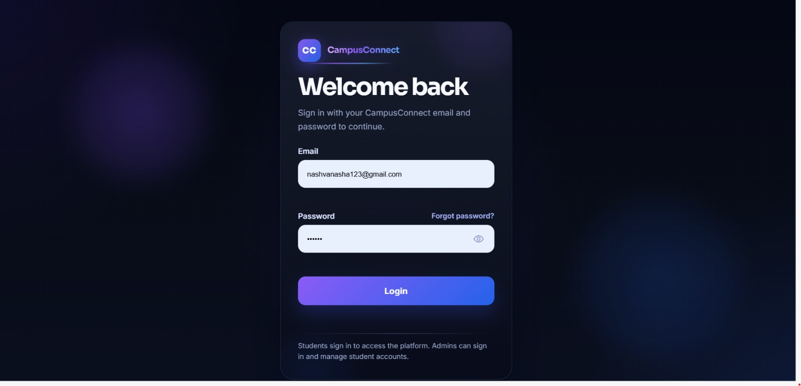
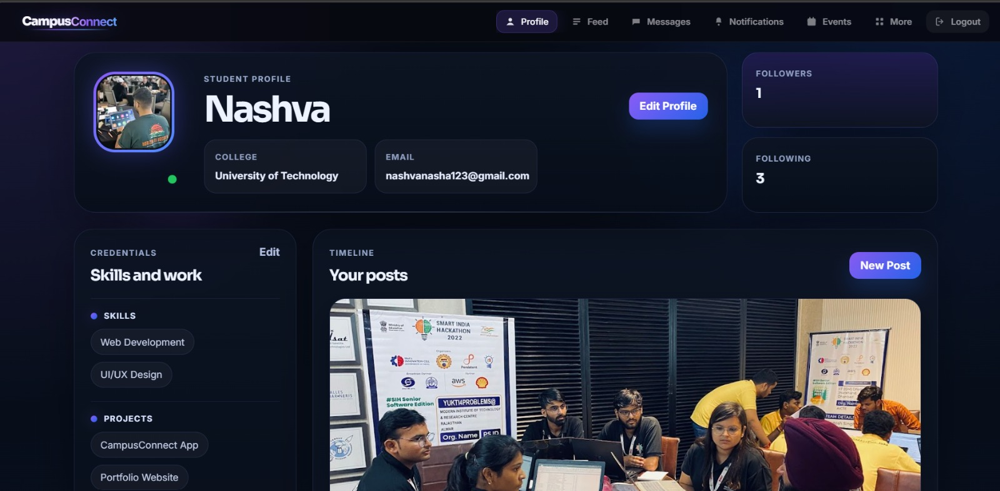
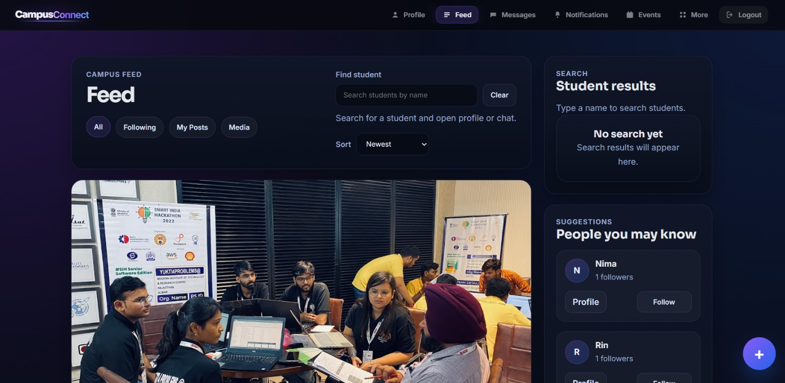
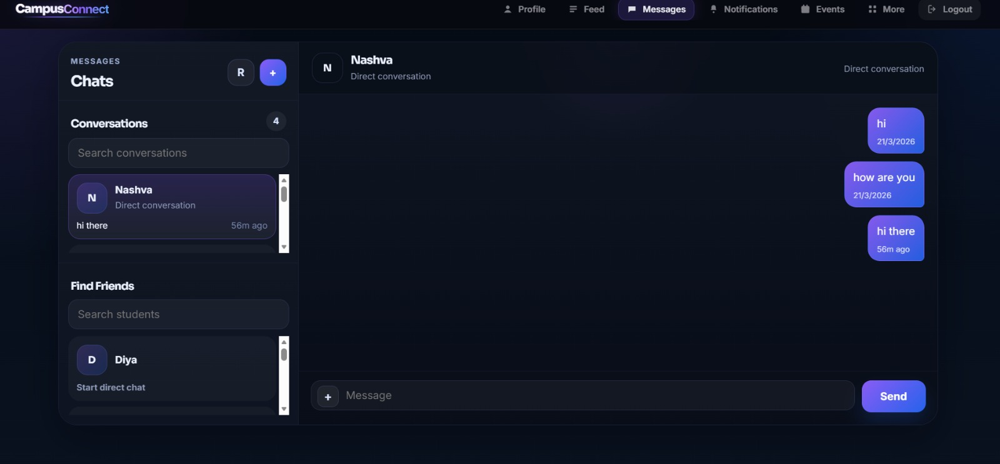
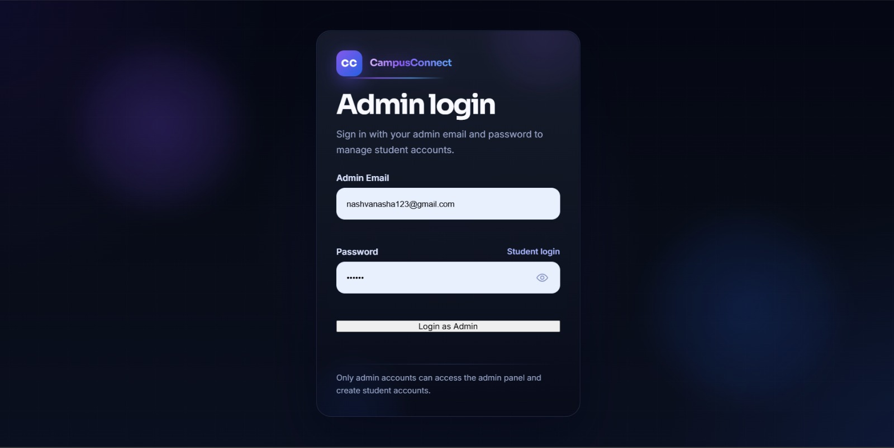
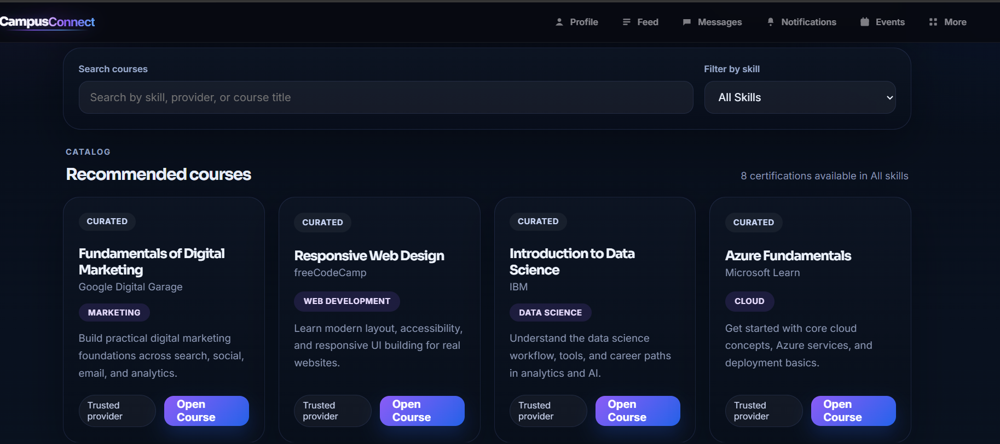
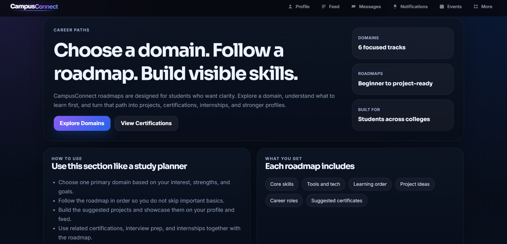

# CampusConnect

CampusConnect is a full-stack student networking and career development platform designed to bring community interaction, communication, and opportunity discovery into one centralized system.

Built as an end-to-end web application, the project combines social features such as profiles, feed, follows, and messaging with career-focused modules like internships, companies, certifications, and learning roadmaps.

## Why I Built It

Students often rely on different tools for peer networking, updates, internships, certifications, and career preparation. That fragmentation makes communication inconsistent and opportunities harder to track.

CampusConnect addresses this by providing a single platform where students can:
- build a visible professional profile
- connect with peers across colleges
- share updates and discover others through a common feed
- communicate through direct and group chat
- explore career and learning resources in one place

## Highlights

- Built a full-stack student platform with authentication, social features, messaging, and career modules
- Implemented role-based access with separate student and admin workflows
- Added real-time messaging with Socket.IO for direct and group chat
- Designed backend APIs for users, posts, follows, profiles, and conversations
- Structured MongoDB models for users, posts, messages, and social relationships
- Created a responsive multi-page interface with consistent navigation and shared UI behavior

## Core Features

### Social and Networking
- Student profile management
- Public student profiles
- Shared feed for posts and updates
- Like, comment, share, and delete post actions
- Follow and follower system
- Student discovery and profile navigation

### Messaging
- Direct messaging
- Group chats
- Real-time message delivery
- Unread message indicators
- Resource and file sharing in chat

### Career and Learning
- Internship module
- Company exploration module
- Certifications page
- Domain roadmaps
- Interview preparation resources
- Resume and mock interview support pages

### Administration
- Separate admin login
- Admin-controlled student account creation
- Role-based protected flows

## Tech Stack

### Frontend
- HTML
- CSS
- JavaScript

### Backend
- Node.js
- Express.js

### Database
- MongoDB
- Mongoose

### Authentication and Security
- JWT (JSON Web Token)
- bcryptjs

### Realtime Communication
- Socket.IO

### Tooling
- Visual Studio Code
- Git
- GitHub
- MongoDB Compass

## Architecture

CampusConnect follows a three-tier architecture:

1. Frontend layer
   - HTML, CSS, and JavaScript handle the user interface and interactions
2. Backend layer
   - Node.js and Express.js manage APIs, authentication, business logic, and real-time chat events
3. Data layer
   - MongoDB stores users, posts, conversations, messages, follows, and profile data

## Project Structure

```text
CampusConnect/
|-- backend/
|   |-- config/
|   |-- controllers/
|   |-- middleware/
|   |-- models/
|   |-- routes/
|   |-- scripts/
|   |-- server.js
|   `-- package.json
|-- css/
|   |-- common/
|   `-- pages/
|-- js/
|   |-- common/
|   `-- pages/
|-- pages/
|-- index.html
`-- README.md
```

## Selected Modules

- Landing page and authentication
- Student profile and public profile pages
- Feed and social interaction flow
- Direct and group messaging
- Notifications
- Internships, companies, and certifications
- Events and domain roadmaps
- Admin account and student creation flow

## How to Run Locally

### 1. Clone the repository

```bash
git clone https://github.com/Nashva55/Campus_Connect.git
cd Campus_Connect
```

### 2. Install backend dependencies

```bash
cd backend
npm install
```

### 3. Configure environment variables

Create a `.env` file inside `backend/` and add:

```env
MONGO_URI=your_mongodb_connection_string
JWT_SECRET=your_secret_key
PORT=5000
```

### 4. Start the backend server

```bash
npm run dev
```

### 5. Run the frontend

Open `index.html` or serve the frontend using Live Server or another local static server.

## Admin Setup

To create an admin account:

```bash
cd backend
npm run create-admin -- --name "Super Admin" --email "superadmin@campusconnect.com" --password "Admin123"
```

Then sign in through:
- `pages/instructor-login.html`

## Demo Flow

1. Open the landing page
2. Log in as a student
3. Show profile editing and profile photo persistence
4. Demonstrate post creation and the shared feed
5. Show follow/public profile behavior
6. Open direct or group messaging and resource sharing
7. Navigate through internships, companies, certifications, and roadmaps
8. Log in as admin and create a student account

## What I Learned

This project strengthened my understanding of:
- full-stack application architecture
- REST API design with Express.js
- secure authentication using JWT and hashed passwords
- MongoDB schema design with Mongoose
- real-time communication using Socket.IO
- state handling across multiple UI modules
- responsive frontend design and shared UI systems

## Future Improvements

- Mobile application version
- Advanced notification center
- Resume builder enhancements
- AI-assisted internship and course recommendations
- Improved analytics and personalization

## Screenshots

Add screenshots to a folder such as `screenshots/` in the project root, then update the image paths below.

### Landing Page


### Student Login


### Student Profile


### Feed


### Messaging


### Admin Panel


### Certifications and Roadmaps



## Repository

GitHub: https://github.com/Nashva55/Campus_Connect

## Author

Developed as a student full-stack mini project.

